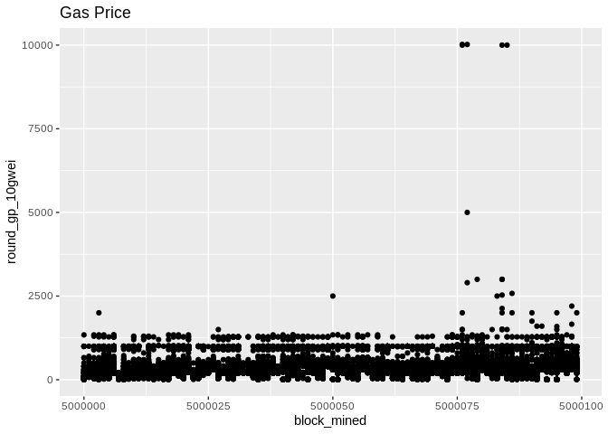
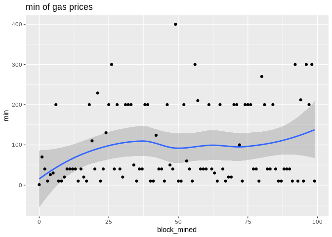
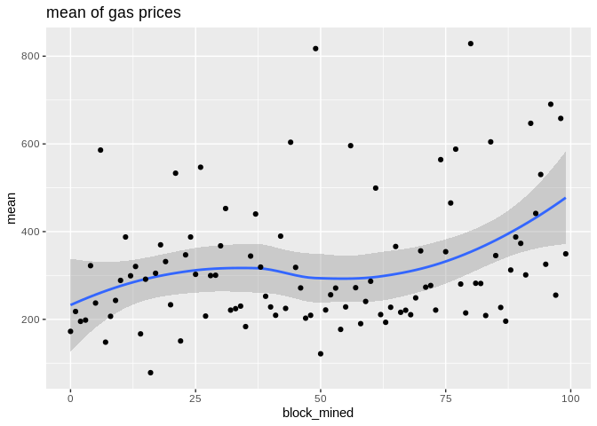
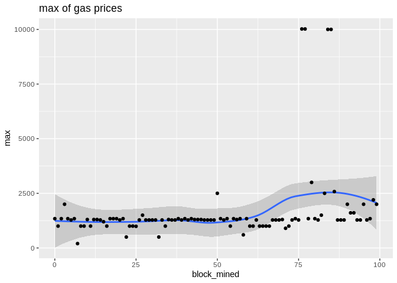
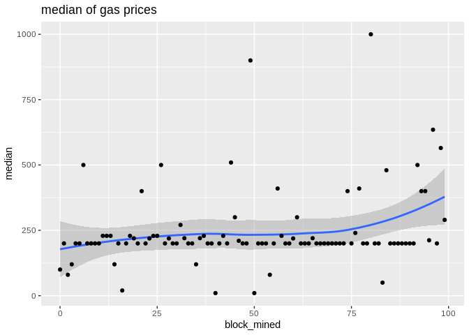
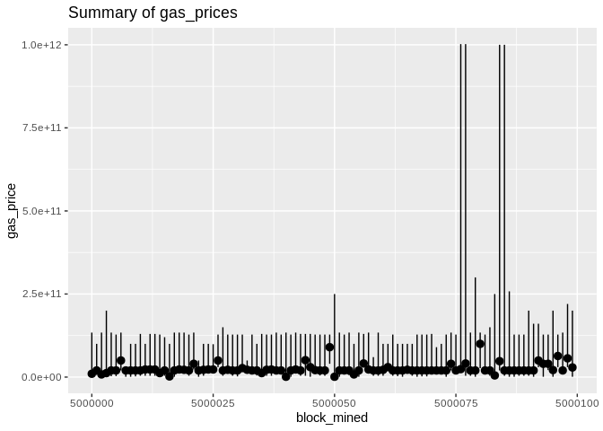
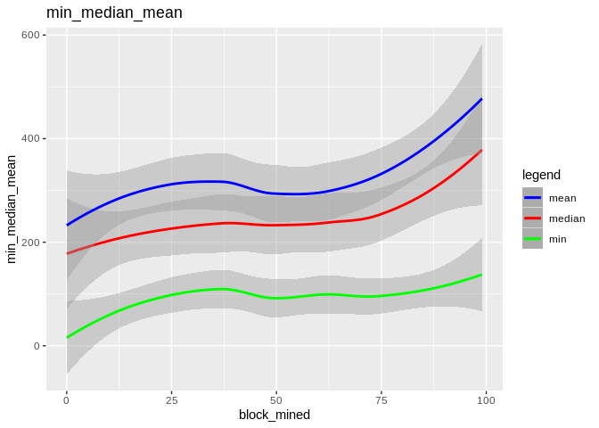
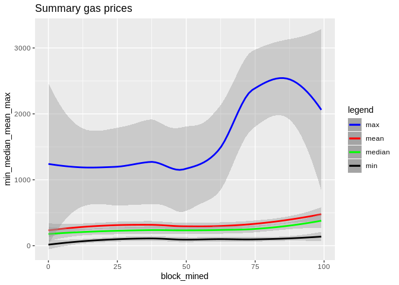

[](https://hackmd.io/c6kyRNMuTnKf_SlolmevRg)
We first download the data from the Ethereum blockchain.

``` python
import pandas as pd
import numpy as np
from web3 import Web3, HTTPProvider


web3 = Web3(HTTPProvider('http://localhost:8545'))

    
class CleanTx():
    """transaction object / methods for pandas"""
    def __init__(self, tx_obj):
        self.hash = tx_obj.hash
        self.block_mined = tx_obj.blockNumber
        self.gas_price = tx_obj['gasPrice']
        self.round_gp_10gwei()
        
    def to_dataframe(self):
        data = {self.hash: {'block_mined':self.block_mined, 'gas_price':self.gas_price, 'round_gp_10gwei':self.gp_10gwei}}
        return pd.DataFrame.from_dict(data, orient='index')

    def round_gp_10gwei(self):
        """Rounds the gas price to gwei"""
        gp = self.gas_price/1e8
        if gp >= 1 and gp < 10:
            gp = np.floor(gp)
        elif gp >= 10:
            gp = gp/10
            gp = np.floor(gp)
            gp = gp*10
        else:
            gp = 0
        self.gp_10gwei = gp


block_df = pd.DataFrame()
for block in range(5000000, 5000100, 1):
    block_obj = web3.eth.getBlock(block, True)
    for transaction in block_obj.transactions:
        clean_tx = CleanTx(transaction)
        block_df = block_df.append(clean_tx.to_dataframe(), ignore_index = False)
block_df.to_csv('tx.csv', sep='\t', index=False)
```

Before we begin, some plots from the raw data (gas price will be normalized later):



Now, we throw out the `round_gp_10gpwei` column and divide the `gas_price` by 10<sup>8</sup>. Then we group our gas prices data by the blocks and we compute a summary (`min,median,mean,max`). The blocks are consecutive and their numbers are made to start from zero in order to have a bit more visually appealing plots!

Here are some plots. `geom_smooth()` uses by default the Local Regression (`loess` for short):

*Loess Regression is the most common method used to smoothen a volatile time series. It is a non-parametric methods where least squares regression is performed in localized subsets, which makes it a suitable candidate for smoothing any numerical vector.*

To show the effectiveness/stability of median over other methods, we plot the data points along with the prediction curve of each (`min,median,mean,max`). Notice the scale of `max` is quite different therefore, although it seems stable its prediction curve has much higher errors than median. See the last two plots to compare the scale of their fluctutations.









Here is the max, median, and min statistics summary plot:



Here is how the mean and median and minimum curves compare:



Here is how all curves compare:



<!-- Let us see how the method `gam` errors compare in each case: -->
<!-- Here you will first need to normalized each column to make this meaningful -->
<!-- ```{r} -->
<!-- gam.med <- gam(min_gas_price~block_mined,data=tx.summary) -->
<!-- gam.med$deviance -->
<!-- ``` -->
