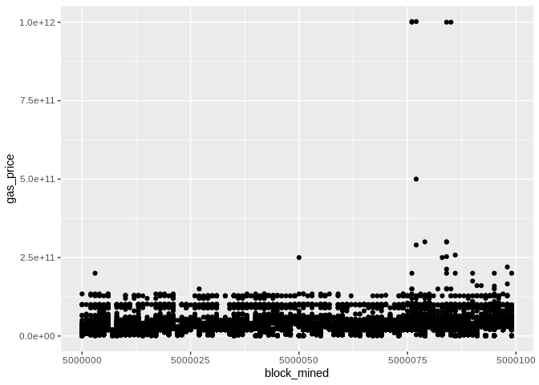

# Path-dependence problem with EIP-1559 and a possible solution to this problem
[](https://hackmd.io/c6kyRNMuTnKf_SlolmevRg)

alidarvishi14@gmail.com

with help from https://github.com/barnabemonnot/abm1559


## Introduction
[EIP 1559](https://eips.ethereum.org/EIPS/eip-1559) is an upgrade to the economic model of Ethereum gas fee. Proposed by Vitalik Buterin in his [Blockchain Resource Pricing](https://github.com/ethereum/research/blob/master/papers/pricing/ethpricing.pdf) paper, this mechanism is going to replace the first-price auction model governing the current fee market for transaction inclusion.

## The basefee and EIP-1559
As discussed in EIP-1559, users have to pay a basefee that will be burned for each transaction. Basefee is updated with a multiplicative rule derived from the size of the last block. If the last block size is more than the target size, basefee will increase, and if the last block is not full enough, basefee will decrease.

In this proposal basefee is updated according to the following formula:


## The simulation of permanent loss
We will simulate the basefee parameter in EIP-1559 and show in a world where only 5% of users are rational enough to optimize for paying less fee if possible, the basefee will eventually decrease to 0.

Later, we are going to show that an additive equation for updating basefee would solve this problem.

First, we implement a class for transactions. In this class we store important data. Users specify these parameters:
* The *gas premium*, i.e., the "tip" to the block producers.
* The *fee cap*, i.e., the highest gas price they are willing to pay.
* The *waiting limit*, i.e., the maximum number of blocks they are willing to wait to get a lower basefee.

``` python
import secrets
%config InlineBackend.figure_format = 'svg'

class Transaction:
    def __init__(self, gas_premium, fee_cap, gas_used,waiting_limit):
        self.gas_premium = gas_premium
        self.fee_cap = fee_cap
        self.gas_used = gas_used
        self.tx_hash = secrets.token_bytes(8)
        self.waiting_limit = waiting_limit
        self.sent_to_memepool = False
        
    def __lt__(self, other):
        return self.gas_premium < other.gas_premium 
```

Then, we import some libraries.

``` python
import pandas as pd

# cadCAD configuration modules
from cadCAD.configuration.utils import config_sim
from cadCAD.configuration import Experiment

# cadCAD simulation engine modules
from cadCAD.engine import ExecutionMode, ExecutionContext
from cadCAD.engine import Executor
```

We declare some constants.

``` python
constants = {
    "BASEFEE_MAX_CHANGE_DENOMINATOR": 8,
    "TARGET_GAS_USED": 12500000,
    "MAX_GAS_EIP1559": 25000000,
    "INITIAL_BASEFEE": 1 * (10 ** 9),
}
```

Here, we declare a demand function that generates new transactions for each block. Gas premium and fee cap are generated randomly.

In this simulation, we assume that only 5% of the transactions are not an emergency and can wait for at most 10 blocks, and the other transactions will be sent immediately after creation.

We can simply see that a rational choice for a user is that if the user thinks basefee will increase, he should send the transaction immediately, and if basefee is going to decrease, he should wait for at least one block. If sent orders fill 50% or more of the block, patient users will wait.

``` python
from random import randint

def update_demand_variable(params, step, sL, s, _input):
    # dict of transactions as a demand
    demand = s["demand"]
    latest_block = s["latest_block"]
    
    # adding new transactions
    for i in range(500):
        gas_premium = randint(1, 10) * (10 ** 8)
        fee_cap = gas_premium + randint(1, 10) * (10 ** 9)
        waiting_limit = 10*(randint(1, 100)<=5)
        tx = Transaction(
            gas_premium = gas_premium,
            gas_used = 25000,
            fee_cap = fee_cap,
            waiting_limit = waiting_limit
        )
        demand[tx.tx_hash] = tx
        
    for tx in latest_block.txs:
        demand.pop(tx.tx_hash)
    
    # estimation of next block size
    basefee = s["basefee"]
    miner_gains = 0
    txs_included = []
    
    for tx_hash, tx in demand.items():
        if not is_valid(tx, basefee):
            continue
        if not tx.sent_to_memepool:
            continue
        gas_price = min([basefee + tx.gas_premium, tx.fee_cap])
        miner_gains += (gas_price - basefee) * tx.gas_used
        txs_included += [tx]
        
    gas_used = sum([tx.gas_used for tx in txs_included])
    is_full = gas_used > 0.5*constants["TARGET_GAS_USED"]
    
    # send transactions and update waiting limit
    for tx_hash, tx in demand.items():
        if tx.waiting_limit == 0 or is_full:
            tx.sent_to_memepool = True
        if tx.waiting_limit>0:
            tx.waiting_limit = tx.waiting_limit-1
        
    return ("demand", demand)
```

Declaring a block and a function to check the validity of transactions.

``` python
class Block():
    def __init__(self, txs):
        self.txs = txs
        
def is_valid(tx, basefee):
    return tx.fee_cap >= basefee
```

This function is going to include valid transactions in the next block.

``` python
def include_valid_txs(params, step, sL, s):
    demand = s["demand"]
    basefee = s["basefee"]
    miner_gains = 0
    txs_included = []
    
    for tx_hash, tx in demand.items():
        # include valid transactions
        if not is_valid(tx, basefee):
            continue
        # include sent transactions
        if not tx.sent_to_memepool:
            continue
        
        
        gas_price = min([basefee + tx.gas_premium, tx.fee_cap])
        miner_gains += (gas_price - basefee) * tx.gas_used
        txs_included += [tx]
        
    assert miner_gains >= 0
    return ({ "block": Block(txs = txs_included) })
```

Update basefee after each block as mentioned in EIP-1559.

``` python
def update_basefee(params, step, sL, s, _input):
    block = _input["block"]
    basefee = s["basefee"]
    
    gas_used = sum([tx.gas_used for tx in block.txs])
    delta = gas_used - constants["TARGET_GAS_USED"]
    new_basefee = basefee + basefee * delta / constants["TARGET_GAS_USED"] / constants["BASEFEE_MAX_CHANGE_DENOMINATOR"]
    
    return ("basefee", new_basefee)
```

Save last block in results.

``` python
def record_latest_block(params, step, sL, s, _input):
    block = _input["block"]
    
    return ("latest_block", block)
```

Run simulation and save the results in a data frame.

``` python
%%capture
from cadCAD import configs

psub = [{
    "policies": {},
    "variables": {
        "demand": update_demand_variable # step 1
    }
}, {
    "policies": {
        "action": include_valid_txs # step 2
    },
    "variables": {
        "basefee": update_basefee, # step 3
        "latest_block": record_latest_block
    }
}]

initial_conditions = {
    "basefee": constants['INITIAL_BASEFEE'],
    "demand": {},
    "latest_block": Block(txs=[])
}

del configs[:]

simulation_parameters = config_sim({
    'T': range(10000),
    'N': 1
})

experiment = Experiment()
experiment.append_configs(
    initial_state = initial_conditions,
    partial_state_update_blocks = psub,
    sim_configs = simulation_parameters
)

exec_context = ExecutionContext()
simulation = Executor(exec_context=exec_context, configs=configs)
raw_result, tensor, sessions = simulation.execute()
df = pd.DataFrame(raw_result)

```

In this plot we show basefee as time passes. We can see basefee is not stable and decreases with time.

``` python
import seaborn as sns
import matplotlib.pyplot as plt

sns.set(style="whitegrid")
df[50:][df.substep == 1].plot('timestep', ['basefee'])
```


## An unintentional uncoordinated attack

Now assume a percentage of users with a considerable number of transactions (like the users of a wallet client designed to have this optimization as a built-in feature) want to pay less basefee, even though, they do not intend to manipulate it. They can simply do so by sending all of their transactions in a more-than-target full block and not sending any transactions in blocks with a size considerably below the target size. This action would make basefee decrease over time and eventually converge to zero. We have to incentivize such honest but rational users to smoothly send their transactions instead of sending them in bulk.

## A possible solution to this attack

The problem of sending a large number of transactions is equivalent to the problem of liquidating a large portfolio as discussed in ["Optimal Execution of Portfolio Transactions"](https://pdfs.semanticscholar.org/3d2d/773983c5201b58586af463f045befae5bbf2.pdf). It is shown in this paper that with an additive cost function, the trader's optimal execution of transaction strategy is to distribute the transactions across time. Therefore, if we update basefee with an additive rule, users are incentivised to gradually send transactions during a long period of time and spread them across different blocks which in turn helps to avoid network congestion.

In this section, we change `update_basefee` function with an additive fucntion which is convex in basefee and gas_used jointly.

``` python
def update_basefee(params, step, sL, s, _input):
    block = _input["block"]
    basefee = s["basefee"]
    
    gas_used = sum([tx.gas_used for tx in block.txs])
    delta = gas_used - constants["TARGET_GAS_USED"]
    new_basefee = basefee + delta / constants["TARGET_GAS_USED"] / constants["BASEFEE_MAX_CHANGE_DENOMINATOR"]
    
    return ("basefee", new_basefee)
```

Run simulation with the new update rule. 

``` python
%%capture
from cadCAD import configs

psub = [{
    "policies": {},
    "variables": {
        "demand": update_demand_variable # step 1
    }
}, {
    "policies": {
        "action": include_valid_txs # step 2
    },
    "variables": {
        "basefee": update_basefee, # step 3
        "latest_block": record_latest_block
    }
}]

initial_conditions = {
    "basefee": constants['INITIAL_BASEFEE'],
    "demand": {},
    "latest_block": Block(txs=[])
}

del configs[:]

simulation_parameters = config_sim({
    'T': range(10000),
    'N': 1
})

experiment = Experiment()
experiment.append_configs(
    initial_state = initial_conditions,
    partial_state_update_blocks = psub,
    sim_configs = simulation_parameters
)

exec_context = ExecutionContext()
simulation = Executor(exec_context=exec_context, configs=configs)
raw_result, tensor, sessions = simulation.execute();
df2 = pd.DataFrame(raw_result)
```

And finally plot the two plots together.

``` python
df.merge(df2,on=['timestep','subset','simulation','run','substep'],suffixes=('_multiplicative','_additive'))[df.substep == 1][50:].plot('timestep', ['basefee_multiplicative','basefee_additive'])
```


## Relation to constant function market makers

This is interestingly related to the concept of path independence in automated market makers (see section 2.3 in [here](https://arxiv.org/abs/2003.10001)). Consider a hypothetical automated market maker as a protocol-level price oracle for the trading pair GAS/ETH whose reserve of gas and ether after the n-th trade are $g_n$ and $f_n \times g_n$, respectively. Moreover, let $g_{n+1} = g_n + M/2 - w_n$, that is, $g +=$ excess. It can be proved that, the limit of $f_n$ as the initial reserve $g_0$ goes to infinity is given by:

- the Almgren-Chriss [additive](https://ethresear.ch/t/draft-position-paper-on-resource-pricing/2838/24) formula in the case of constant sum market maker,


- and Vitalik's proposed [exponential](https://ethereum-magicians.org/t/eip-1559-fee-market-change-for-eth-1-0-chain/2783/26) formula in the case of constant product market maker.


This observation immediately implies that both of these update rules (and any other one based on another constant function market maker) are path-independent. Ironically, this is exactly why we have arrived at these formulas in the first place when attempting to solve a simple instance of path dependence attacks.

## An improvement for the premium

Even with EIP-1559, the problem of overpayment in the first price auction (winner's curse) remains relevant for the premium. A very simple solution, in terms of [Kolmogorov complexity](https://github.com/ethereum/research/blob/master/papers/pricing/ethpricing.pdf), is to use a sliding median which is more stable and predictable than the first price auction.

It is well-known that median is a robust statistic but to show this in practice, we first download the gas fee data from the Ethereum blockchain.

``` python
import pandas as pd
import numpy as np
from web3 import Web3, HTTPProvider


web3 = Web3(HTTPProvider('http://localhost:8545'))

    
class CleanTx():
    """transaction object / methods for pandas"""
    def __init__(self, tx_obj):
        self.hash = tx_obj.hash
        self.block_mined = tx_obj.blockNumber
        self.gas_price = tx_obj['gasPrice']
        self.round_gp_10gwei()
        
    def to_dataframe(self):
        data = {self.hash: {'block_mined':self.block_mined, 'gas_price':self.gas_price, 'round_gp_10gwei':self.gp_10gwei}}
        return pd.DataFrame.from_dict(data, orient='index')

    def round_gp_10gwei(self):
        """Rounds the gas price to gwei"""
        gp = self.gas_price/1e8
        if gp >= 1 and gp < 10:
            gp = np.floor(gp)
        elif gp >= 10:
            gp = gp/10
            gp = np.floor(gp)
            gp = gp*10
        else:
            gp = 0
        self.gp_10gwei = gp


block_df = pd.DataFrame()
for block in range(5000000, 5000100, 1):
    block_obj = web3.eth.getBlock(block, True)
    for transaction in block_obj.transactions:
        clean_tx = CleanTx(transaction)
        block_df = block_df.append(clean_tx.to_dataframe(), ignore_index = False)
block_df.to_csv('tx.csv', sep='\t', index=False)
```

Before we begin, some plots from the raw data (gas price will be normalized later):



Now, we throw out the `round_gp_10gpwei` column and divide the `gas_price` by 10<sup>8</sup>. Then we group our gas prices data by the blocks and we compute a summary (`min,median,mean,max`). The blocks are consecutive and their numbers are made to start from zero in order to have a bit more visually appealing plots!

Here are some plots. `geom_smooth()` uses by default the Local Regression (`loess` for short):

*Loess Regression is the most common method used to smoothen a volatile time series. It is a non-parametric methods where least squares regression is performed in localized subsets, which makes it a suitable candidate for smoothing any numerical vector.*

To show the effectiveness/stability of median over other methods, we plot the data points along with the prediction curve of each (`min,median,mean,max`). Notice the scale of `max` is quite different therefore, although it seems stable its prediction curve has much higher errors than median. See the last two plots to compare the scale of their fluctutations.


Here is the max, median, and min statistics summary plot:


Here is how the mean and median and minimum curves compare:


Here is how all curves compare:


<!-- Let us see how the method `gam` errors compare in each case: -->
<!-- Here you will first need to normalized each column to make this meaningful -->
<!-- ```{r} -->
<!-- gam.med <- gam(min_gas_price~block_mined,data=tx.summary) -->
<!-- gam.med$deviance -->
<!-- ``` -->

## Summary and further resources

Designed an attack for EIP-1559 and proposed an alternative transaction fee pricing protocol based on the Almgren–Chriss framework and median price auctions.

- https://ethresear.ch/t/path-dependence-of-eip-1559-and-the-simulation-of-the-resulting-permanent-loss/8964
- https://github.com/ethereum/EIPs/blob/master/EIPS/eip-3416.md
